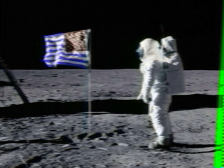

# Luna Guesser 

- Judging by the sounds this is `sstv`(more on google), so just google a way to decrypt it which leads us to this article

https://ourcodeworld.com/articles/read/956/how-to-convert-decode-a-slow-scan-television-transmissions-sstv-audio-file-to-images-using-qsstv-in-ubuntu-18-04

- Step 1 and 2 of the article produces errors for me so just skip em and follow from the first step 3 onward

- After that you will get this image 

- As you can see its a picture of the moon landing, the challenge asks us for the location where this was taken so just google 

`Lunar Module landing location apollo 11`, the lunar module is a piece of info we get from the `apollo 11 wiki`

# Flag flag{mare_tranquilitatis}  